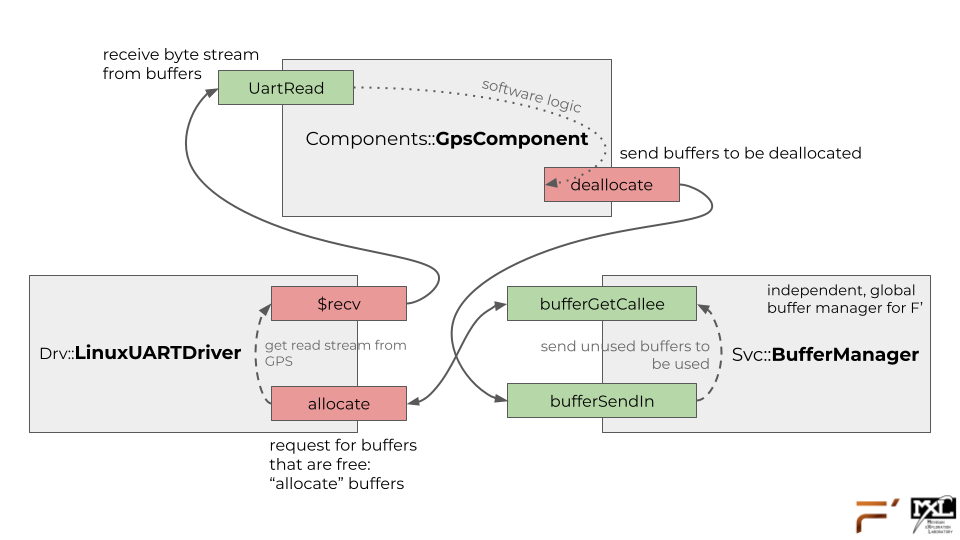
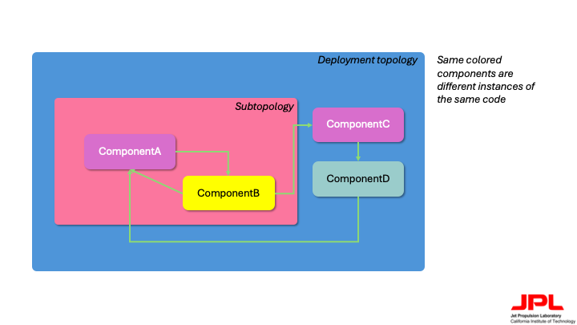

# Subtopology AC Design

1. [Subtopologies vs Topologies](#subtopologies-vs-topologies)
2. [Subtopology shortcomings](#subtopology-shortcomings)
    - [Multiple uses of a subtopology](#1-multiple-uses-of-a-subtopology)
    - [Interfacing to the subtopology](#2-interfacing-to-the-subtopology)
3. [Presented solution](#presented-solution)
    - [Requirements](#requirements)
    - [Solution](#solution)

## Subtopologies vs Topologies

The design of this tool originates from the existence of the subtopology pattern within F Prime, which originate from the topology pattern. Topologies are the backbone of any F Prime project, as they describe what components a project uses and how they are wired together. Topologies are elements of deployments, which are deliverables from a single F Prime project. For example, a project may want to reference data packets (i.e., time, altitude) from a UART-based GPS module. Thus, they will need to instantiate a hardware interface driver for UART for their operating system, a memory manager that can circulate buffers to and from the bytestream, and a component to deal with software logic for the GPS.

|  | 
|:--:| 
| *Fig 1. A visualization of what our example topology above may look like* |

As a project grows in size, scope and behavior requirements, its topology will no doubt also become much more complex. Because of this, it will become inefficient to maintain a single topology definition for a project. Thus, the concept of subtopologies aims to address this by allowing flight software developers to “chunk” topologies into smaller, more manageable sections, to then be included into a single unified topology. Our example with the GPS component works well with the subtopology pattern, as it allows for easier management of this topology. It also creates boundaries around the topology, preventing potential errors (i.e., syntax, port management) that might arise from maintaining a complex topology. Subtopologies are initialized separately from a main deployment’s topology and are then imported into the deployment topology to be referenced and utilized. While subtopologies can contain bits of wiring, it is also possible to wire from inside the subtopology to the outside topology. Most importantly, subtopologies can be included with [F Prime libraries](https://nasa.github.io/fprime/HowTo/develop-fprime-libraries.html), providing a method of delivery to a project and discovery to the F Prime build process.

|  | 
|:--:| 
| *Fig 2. A visualization of what a subtopology may look like* |

## Subtopology shortcomings

As described above, subtopologies are a very powerful feature of F Prime. However, in their current form, there exist some limitations that currently make subtopologies hard to justify and maintain for larger-scale projects.

> For the sake of this section, `topology st` will be the subtopology, and `topology main` will be the main deployment topology.

### 1. Multiple uses of a subtopology

It may be the case that I would like to have multiple uses of `st` within `main`. For example, `st` could define the topology for managing a single temperature sensor, but I would like to implement $n$ number of those sensors. At the moment, to do this one would need to duplicate the entire subtopology and make proper modifications to instances, the TopologyDefs file, and more.

### 2. Interfacing to the subtopology

Let's maintain our example of `st` being the topology for managing a single temperature sensor. It may be the case that `st` only implements the software behavior, as is reasonable: the developer of the subtopology probably cannot write hardware interface drivers for every platform possible. So, the user would provide the proper driver to `st`, which is again reasonable. However, to accomplish this one would need to modify the contents of a subtopology, changing instance definitions and possibly the connection graphs as well. Such a task could become monstrous if, say `st` now implements the [hub pattern](https://nasa.github.io/fprime/UsersGuide/best/hub-pattern.html).

## Presented solution

The solution presented in this tool is to allow for the ability to create "subtopology instances" (see [this page](./README.md) for the disclaimer about this terminology). The following are some requirements for what this tool should be able to do, and how to do it.

### Requirements

> "This tool" refers to the subtopology autocoder

- This tool shall be able to execute automatically during the build process
- This tool shall be able to create named "instances" of subtopologies available for import
- This tool shall be interfaced with through the existing F Prime project files (i.e., fpp)
- This tool shall be able to drop in elsewhere-defined instance definitions in place of other instances in a subtopology
- This tool shall be able to replace fpp-based configuration variables in a subtopology with a user-defined subtopology config file.
- This tool shall be usable with minimal human intervention, aside from subtopology instance-specific configurations
- This tool shall not add more than 15 seconds to the build process execution time in a subtopology-free project.
- This tool shall process each subtopology instance in no more than 5 seconds during the build process.

### Solution

Using [fpp](https://github.com/nasa/fpp)'s native annotation capability, this tool depends on developers implementing "magic annotations" within their fpp file which is read by the autocoder tool and processed. This tool depends on the [`fpp-to-json`](https://github.com/nasa/fpp/wiki/fpp-to-json) tool that is able to create an Abstract Syntax Tree (AST) of each fpp file. This allows for the tool to be able to rebuild topologies, modules, and their elements more precisely after processing.

> The [fpp_json_ast_parser.py](../src/ac_tool/fpp_json_ast_parser.py) utility file is built as a universal class-based traversal tool. If you would like to be able to programmatically read fpp files using fpp-to-json, this tool may be useful.

The syntax and usage of this tool is discussed in the [Syntax](./Syntax.md) and [Example](./Example.md) files. This "magic syntax" allows for:

- Replacing instance definitions in a subtopology
- Replacing the config module for the subtopology
- Defining component instances to be "local" to a subtopology
- Defining a base id offset for all instances in the subtopology

The autocoder will parse these annotations, and produce two files within the given build cache:

- `<ModuleName>.subtopologies.fpp` - all instantiated topologies in a given F Prime module
- `st-locs.fpp` - the location for all new defined elements (i.e. local instances, subtopologies)
- `<ModuleName>.fpp` - a copy of the input file that has the subtopology instance syntax, with it configured properly for the build system.

This is the reason why our autocoder *must* run before any of the other autocoders. In essence, our tool is a pre-processor that produces `.fpp` files that are on the level of pre-autocode (as in, autocode from fpp-to-cpp). These files are then automatically passed to the next autocoders, that process then and integrate them into the final build. 