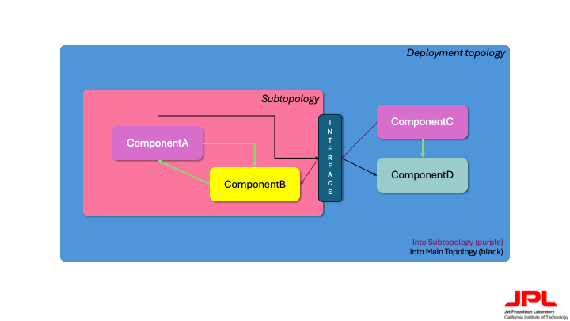

# Subtopology AC Formal Interfaces

Before reading this file, it is recommended to take a quick glance over the [Syntax](./Syntax.md) document.

1. [Rationale](#rationale)
2. [Implementation](#implementation)
3. [Wrap-Up](#wrap-up)

## Rationale

In the [Design](./Design.md) document, we see that the way subtopologies exist within F Prime allow for them to be standalone units of components and wiring that, now with this tool, can be instantiated *like* classes. With instances, we are able to drop in new definitions to component instances used in a subtopology. However, what if we would like to wire a specific port from a component outside the subtopology? What if we would like to control local component instances in subtopologies? Since we cannot replace those, we do not have fine-grained "control" over local components. Additionally, having to track many different components and their ports may become a quite difficult task, especially if you have not developed the subtopology you are using.

As such, the logical step is to provide a manner of defining a "subtopology interface": a one-stop shop "communication layer" that routes outputs from the subtopology into the main topology, and also inputs from the main topology into the subtopology. In essence, this is very similar to the concept of an "export list": the subtopology "exposes" inputs and outputs to and from it respectively to allow for further customization of them.

|  | 
|:--:| 
| *Fig 1. A visualization of a subtopology interface* |

A great example use-case of subtopology interfaces is if a component inside the subtopology utilizes a clock (active rate group). Usually in F Prime projects, you will define one instance of an active rate group, which has an $n$-sized output bus to hook up to different components that require the clock. In such a case, it does not make sense to drop in the full rate group into the subtopology. Rather, you provide the subtopology with an input clock signal that can be utilized among local/other components in the subtopology.

## Implementation

The way a subtopology interface is created is through creating input and output "components". We put components in quotes because ultimately in a final deployment build, the components are autocoded out, instead replaced by simple connection graphs in `.fppi` files.

> [!IMPORTANT]  
> Interfaces for a subtopology *must* be defined in a folder called `ST-Interface` within your subtopology module. This is to help autocode the passive component definitions out of the build.

Inside this folder, two passive components are created: `Input` and `Output`. `Input` is the interface that routes data from a main topology into the subtopology, while `Output` does the inverse. You do not need to define both interfaces to have a working subtopology (i.e, you could have only an `Input` or only an `Output` interface). For these two components, pairs of input/output ports (defined as **port pairs**) must be created *on each interface*.

For both interface types, port pairs must be in the following style:

```
module MySubtopologyInterface {
    passive component Input {
        sync input port <PortName>: U32 # arbitrary type
        output port <PortName>_in: U32 # arbitrary type

        ...
    }

    passive component Output {
        sync input port <PortName>: U32 # arbitrary type
        output port <PortName>_out: U32 # arbitrary type

        ...
    }
}
```

To use these interfaces, they first must be defined. Definitions should go in your subtopology's fpp file. This is once again to help with the components being phased out.

```
module MySubtopology {
    ...

    instance Input: MySubtopologyInterface.Input base id 0xAAAA
    instance Output: MySubtopologyInterface.Output base id 0xBBBB

    topology MySubtopology {
        @! is interface input # see the Syntax.md file for more info
        instance Input

        @! is interface output
        instance Output

        ...
    }
}
```

Then, the interfaces are utilized as simple connection pairs in non-arbitrarily named contact graphs. Within your main topology, the contact graph should be named `Interface_<NameOfSubtopologyInstance>`, while in the subtopology itself, it should be named `Interface`. This naming convention also proves useful when trying to use the F Prime topology [visualizer](https://github.com/fprime-community/fprime-visual), as it keeps the interface connections separated and more easily visualizable.

So, to demonstrate this with proper syntax:

```
# in the main topology

module MainTopology {
    ...

    topology TopInst {}
    @<! is MySubtopology.MySubtopology base id 0xCCCC

    topology MainTopology{
        import TopInst

        ...

        # this is NOT the name of the instance! It is the name of the original subtopology
        instance MySubtopology.Input 
        instance MySubtopology.Output

        # other arbitrary instances
        instance rateGroup

        connections Interface_TopInst {
            rateGroup.RateGroupMemberOut[2] -> MySubtopology.Input.clock
        }
    }
}

# in the subtopology

module MySubtopology {
    ...

    topology MySubtopology {
        ...

        instance MySubtopology.Input
        instance MySubtopology.Output

        # arbitrary instance
        instance a

        ...

        connections Interface {
            MySubtopology.Input.clock_in -> a.in
        }
    }
}
```

While the above minimal example only demonstrates the usecase for the `Input` interface, a similar logic works for the `Ouput` interface, where the `<PortName>_out` port is hooked up in the main topology, and the `<PortName>` port is hooked up in the subtopology.

After the autocoder tool runs, a `.fppi` file ("fpp include") is generated that phases out the connection graphs and `Input`/`Ouput` interface definitions, and is ultimately included in the main topology.

```
# example autocoded .fppi file

instance __Testing_instances.rng

connections Interface_Testing {
    rateGroup2.RateGroupMemberOut[2] -> a.in
}
```

As you may notice, the interfaces are "collapsed" in the build process, producing a straight input-to-output wiring from the source to the destination. We use the concept of components to develop the "front-end" view of the interface, as it provides quite a noticeable difference in error checking. For example, if a port is not properly wired in the interface, a proper and more understandable fpp error is output. It also ensures that ports are hooked up to same-type ports.

## Wrap-Up

The following document provided information about subtopology interface as interpreted by this tool. An example use-case of the interface is provided in the [Example](./Example.md) document.